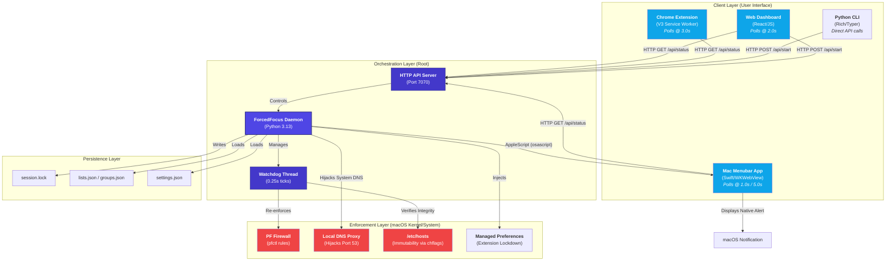

# ForcedFocus v2 ⚡

ForcedFocus is a multi-layered, root-level productivity enforcement system for macOS. It combines a system daemon, a native menubar utility, a web dashboard, and a browser extension to create a "defense-in-depth" environment for deep work.

## 🗺️ System Architecture

The following map illustrates the synchronization between the orchestration layer (daemon), the user interfaces, and the system-level enforcement.

## 🛠️ Core Components

### 1. The Daemon (`forcefocus_daemon.py`)
The "Source of Truth" for the entire system. Running as root, it manages the session lifecycle, enforces network rules, and provides a local REST API on port 7070.
*   **Watchdog**: A high-frequency thread (4Hz) that monitors for tampering.
*   **Atomic Sync**: Uses monotonic clocks and atomic JSON writes to ensure state integrity across reboots.

### 2. Mac Menubar App (`ForcedFocusBar.app`)
A native Swift utility that provides a persistent countdown in the system bar.
*   **Native Bridge**: Tunnels daemon notifications through the app to maintain OS-level branding and grouping.
*   **Adaptive Polling**: Synchronizes its state at 1Hz during sessions and 0.2Hz when idle.

### 3. Chrome Extension
The browser-level enforcement layer using Manifest V3.
*   **DNR Blocking**: Intercepts requests using the `declarativeNetRequest` API for zero-latency blocking.
*   **Policy Lockdown**: Protected by daemon-injected Managed Preferences to prevent uninstallation.

### 4. Web Dashboard
A comprehensive React-based UI for managing domain lists, groups, schedules, and custom audio assets.

---

## 🛡️ Enforcement Mechanisms

### Blacklist Mode
*   **DNS Redirection**: Redirects blacklisted domains to `127.0.0.1` via `/etc/hosts`.
*   **Immutability**: Uses `chflags uchg` to prevent editing of the hosts file.
*   **QUIC Blocking**: Blocks UDP 443 to force browsers to honor system DNS.

### Whitelist Mode
*   **Default Deny**: All DNS requests return `NXDOMAIN` unless explicitly allowed.
*   **DNS Hijacking**: Changes system DNS to `127.0.0.1` via `networksetup`.
*   **Site Bundles**: Automatically allows required CDNs and asset domains for whitelisted sites.

### Rescue Throne (Nuclear Mode)
*   **Total Isolation**: A whitelist session with an empty allow-list.
*   **No Escape**: Enforces a mandatory 20-minute delayed unlock even if the correct bypass code is entered.

---

## 🔄 Synchronization Logic

ForcedFocus uses an **Adaptive Pull Model** to keep all components in sync:

1.  **Audio Sync**: Focus cues are played by the **Daemon** using `afplay`. This ensures alerts play even if the browser is closed or the OS is under heavy load.
2.  **Intent Sync**: Goals and To-Do tasks are synchronized across all UIs. Checking a task in the browser instantly reflects in the Menubar popover.
3.  **Schedule Sync**: Scheduled sessions are persisted in `session.lock` and triggered by the Daemon's watchdog based on monotonic time, preventing "drift" from system clock changes.
4.  **Habit Sync**: Optional audio cues play the moment a blocked site is opened, providing immediate Pavlovian feedback to the user.

## 🚀 Getting Started

1.  Run `sudo ./install.sh` to install the daemon and CLI.
2.  Launch `ForcedFocusBar.app` for the menubar interface.
3.  Install the Chrome Extension from the `chrome-extension` directory.
4.  Open `http://127.0.0.1:7070` to configure your first session.
