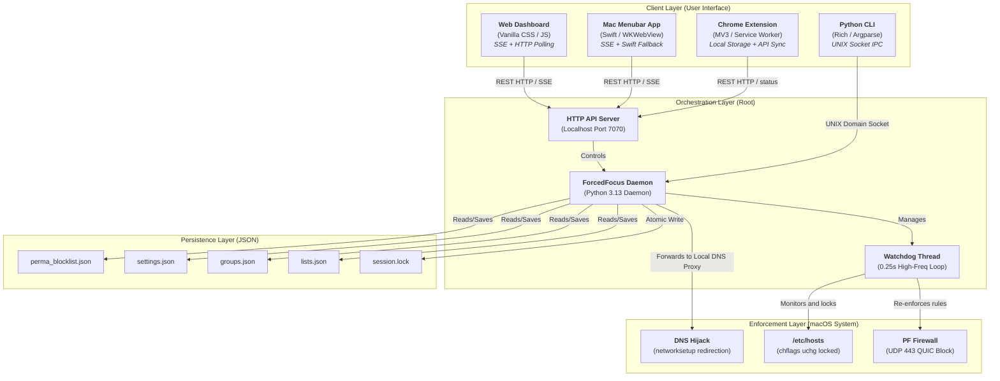

# ⚡ ForcedFocus

[](https://www.apple.com/macos)
[](https://www.python.org/)
[](https://developer.apple.com/swift/)
[](https://github.com/aboda/ForcedFocu)

ForcedFocus is a multi-layered, root-level productivity enforcement utility for macOS. It establishes a high-integrity, un-bypassable deep work environment using "defense-in-depth" operating system restrictions. 

Unlike standard website blockers that are trivial to turn off, ForcedFocus enforces focus commitments through cryptographic delays, hardware-level network locks, DNS redirection, and kernel/filesystem-level safeguards (such as write-locking `/etc/hosts` via filesystem attributes).

---

## 🚀 Key Features

*   **High-Integrity Session Locking**: Start focus sessions with cryptographic passphrases. Stopping a session prematurely requires entering your security key, which starts an **enforced 20-minute cooldown delay** before unlocking.
*   **Defense-in-Depth Network Blocking**:
    *   **PF Firewall Rules (`pfctl`)**: Blocks UDP port 443 (QUIC/HTTP3 protocol bypasses) at the packet level.
    *   **DNS Hijacking**: Redirects queries to a local loopback listener (`127.0.0.1:53`).
    *   **Immutable `/etc/hosts`**: Modifies host files and locks them with system-level immutable flags (`chflags uchg /etc/hosts`) to prevent manual editing.
*   **Pomodoro Engine**: Fully customizable Pomodoro sessions (cycles, focus/break periods, automated transitions) with audible cues.
*   **Tactical Dark Mode Web Dashboard**: An ultra-clean, developer-centric interface served locally on port `7070` using vanilla HTML5, ES6 JavaScript, and raw CSS.
*   **Native Menubar App**: A native macOS Swift wrapper containing a sandboxed `WKWebView` to display the control dashboard right from the status bar, featuring native Swift polling fallbacks.
*   **Chrome Extension (Manifest V3)**: Native browser integration running a background service worker to block URLs using `chrome.declarativeNetRequest` and present a structured "Blocked" placeholder page.
*   **Powerful CLI Client**: Structured console management featuring formatted telemetry grids, table printouts, and interactive panels styled with the `Rich` Python library.

---

## 🛠️ Technology Stack

| Layer | Component | Technologies |
| :--- | :--- | :--- |
| **Client Layer** | Web Dashboard | HTML5, Vanilla ES6 JavaScript, Custom CSS Variables |
| | macOS Menubar App | Swift, WebKit (`WKWebView`), AppKit |
| | CLI Utility | Python 3.13, `rich`, `argparse` |
| | Chrome Extension | Manifest V3, JavaScript Service Worker, `chrome.declarativeNetRequest` |
| **Orchestration**| Root Daemon | Python 3.13, UNIX domain socket IPC, HTTP REST server (port `7070`) |
| **Enforcement** | macOS System Locks | PF Firewall (`pfctl`), DNS Redirect, `/private/etc/hosts` (`chflags`) |
| **Persistence** | Configuration DB | Local JSON schemas in `/etc/forcefocus/`, atomic file operations |

---

## 📐 Project Architecture

ForcedFocus splits responsibilities across user-facing client layers, an orchestration daemon running as root, local persistence files, and system-level configuration boundaries.


```mermaid
graph TB
    subgraph "Client Layer (User Interface)"
        WebUI["<b>Web Dashboard</b><br/>(Vanilla CSS / JS)<br/><i>SSE + HTTP Polling</i>"]
        MacApp["<b>Mac Menubar App</b><br/>(Swift / WKWebView)<br/><i>SSE + Swift Fallback</i>"]
        Extension["<b>Chrome Extension</b><br/>(MV3 / Service Worker)<br/><i>Local Storage + API Sync</i>"]
        CLI["<b>Python CLI</b><br/>(Rich / Argparse)<br/><i>UNIX Socket IPC</i>"]
    end

    subgraph "Orchestration Layer (Root)"
        Daemon["<b>ForcedFocus Daemon</b><br/>(Python 3.13 Daemon)"]
        Watchdog["<b>Watchdog Thread</b><br/>(0.25s High-Freq Loop)"]
        APIServer["<b>HTTP API Server</b><br/>(Localhost Port 7070)"]
    end

    subgraph "Enforcement Layer (macOS System)"
        PF["<b>PF Firewall</b><br/>(UDP 443 QUIC Block)"]
        DNS["<b>DNS Hijack</b><br/>(networksetup redirection)"]
        Hosts["<b>/etc/hosts</b><br/>(chflags uchg locked)"]
    end

    subgraph "Persistence Layer (JSON)"
        Lock["session.lock"]
        Lists["lists.json"]
        Groups["groups.json"]
        Settings["settings.json"]
        Perma["perma_blocklist.json"]
    end

    %% Communication
    CLI -- "UNIX Domain Socket" --> Daemon
    WebUI -- "REST HTTP / SSE" --> APIServer
    MacApp -- "REST HTTP / SSE" --> APIServer
    Extension -- "REST HTTP / status" --> APIServer

    APIServer -- "Controls" --> Daemon
    Daemon -- "Manages" --> Watchdog

    %% System Lockdown
    Watchdog -- "Re-enforces rules" --> PF
    Watchdog -- "Monitors and locks" --> Hosts
    Daemon -- "Forwards to Local DNS Proxy" --> DNS

    %% Data Read/Write
    Daemon -- "Atomic Write" --> Lock
    Daemon -- "Reads/Saves" --> Lists
    Daemon -- "Reads/Saves" --> Groups
    Daemon -- "Reads/Saves" --> Settings
    Daemon -- "Reads/Saves" --> Perma
```

---

## 📂 Project Structure

```bash
├── ForcedFocusBar.app/       # Native Compiled macOS Menubar App bundle
├── build_menubar.sh          # Swift compilation and app bundling script
├── chrome-extension/         # Manifest V3 Chrome redirect-blocker extension
│   ├── background.js         # declarativeNetRequest rule synchronizer
│   ├── blocked.html          # Intrusive block interruption page
│   └── manifest.json         # Extension permissions and background config
├── cli/                      # CLI modules
│   ├── main.py               # Main CLI command parser & routing logic
│   ├── client.py             # UDS Socket IPC communication client
│   └── commands/             # Individual commands (start, stop, status, etc.)
├── forcefocus_cli.py         # Entry point for the CLI tool
├── forcefocus_daemon.py      # Python Root-Level Daemon (Watchdog & pfctl hooks)
├── forcefocus_web.py         # Web Server hosting REST endpoints & SSE channels
├── forcefocus_menubar.swift  # Swift source code for status-bar panel
├── install.sh                # Interactive root system deploy installer
├── uninstall.sh              # Secure root system cleanup utility (requires key)
├── shared/                   # Shared resources between web dashboard and extension
│   ├── tokens.css            # Tactical Dark theme CSS variables
│   └── intent-tasks.js       # Sync utilities for task checklists
├── sync_shared.sh            # Script to sync files to web/ and extension subdirectories
└── web/                      # Embedded web server directories
    ├── index.html            # Main web dashboard interface
    ├── app.js                # Core dashboard frontend scripts
    ├── styles.css            # Dark Mode tactical theme styling definitions
    └── settings.html         # Settings configuration template
```

---

## 🚦 Getting Started

### Prerequisites

*   **Operating System**: macOS (requires `pfctl` support and `launchd`).
*   **Runtime**: Python 3.13 or newer.
*   **Privileges**: Root privileges (`sudo`) are required to install, start the daemon, and bind to restricted system configurations.

### Installation

Clone the repository and run the installer script as root:

```bash
sudo bash install.sh
```

During installation, the installer will:
1. Initialize `/etc/forcefocus/` with secure folder permissions.
2. Compile the macOS Native Menubar Application and deploy it to `/Applications/ForcedFocusBar.app`.
3. Register the LaunchDaemon (`com.forcefocus.daemon.plist`) under `launchd` to boot at startup.
4. Prompt you to enter a **Security Key** passphrase (hashed securely via PBKDF2). This key is required to stop/modify sessions.

### Uninstallation

To remove the LaunchDaemon, binary paths, configs, and restore your `/etc/hosts` file, run the uninstaller:

```bash
sudo bash uninstall.sh
```
*Note: You must enter your Security Key passphrase to authorize uninstallation.*

---

## 💻 Command Line Interface (CLI)

The CLI utility is installed to `/usr/local/bin/forcefocus` and accepts several subcommands.

```bash
# Start a 60-minute blacklist session
sudo forcefocus start --duration 60 --mode blacklist

# Start a Pomodoro cycle session (4 cycles of 25m focus / 5m break)
sudo forcefocus start --type pomodoro --focus 25 --break 5 --cycles 4

# View current focus session telemetry and remaining seconds
forcefocus status

# Manage domain category groups
forcefocus groups list
forcefocus groups add social facebook.com twitter.com instagram.com
forcefocus groups remove social instagram.com

# Schedule a focus session for a specific time
sudo forcefocus start --at 09:00 --duration 180

# Trigger a delayed session stop (requests security key and counts down 20 minutes)
forcefocus stop
```

---

## 🎨 Visual Identity & Style Guide

ForcedFocus adopts a **"Tactical Dark Mode"** aesthetic. The design is structured, geometric, and developer-focused:

*   **Obsidian Base**: Hex `#09090B` backgrounds represent safety and deep workspace layout.
*   **Carbon Surface**: Hex `#18181B` for structured card layouts, panels, and borders.
*   **Sharp Borders**: Geometric focus with `1px solid #27272A` lines, flat block shadows (`box-shadow: 4px 4px 0px #000000`), and minimal radii (`6px` for cards, `4px` for inputs).
*   **Monospace Typography**: Countdowns, data feeds, and tags utilize `JetBrains Mono` or `SF Mono` with tabular numerals to prevent digit shift layout shifts.

*For details, view the [ForcedFocus UI/UX Implementation Spec](file:///Users/aboda/Documents/ForcedFocu/design.md).*

---

## 🧪 Testing and Verification

To verify script syntax and logic boundaries before deployments:

```bash
# Verify JavaScript script compilations
node --check web/app.js
node --check web/settings.js

# Validate LaunchDaemon PLIST syntax
plutil -lint /Library/LaunchDaemons/com.forcefocus.daemon.plist

# Execute Python test suits (Requires pytest package)
python3 -m pytest
```

---

## 🤝 Contributing

1. Always preserve design system tokens in CSS (`shared/tokens.css`).
2. Adhere to **High-Integrity UI Rules**: Configuration pages, session settings, and custom rule managers must remain interactive during active blocking. Only block destructive actions that cancel active protections.
3. Validate and check API contracts (REST endpoints on port `7070`) when introducing changes to client apps.

---

## 📄 License

This project is licensed under the MIT License - see the LICENSE file for details.
