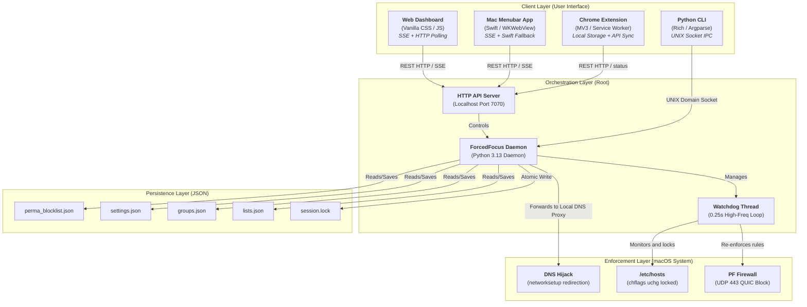

# ForcedFocus v3.1 ⚡

A root-level, multi-layered productivity enforcement system for macOS designed to lock out distractions at the system core.

---

## 1. Core Philosophy & Defense in Depth

Modern productivity apps are easily bypassed by disabling browser extensions, editing configuration files, or stopping user-space processes. **ForcedFocus** solves this problem by enforcing focus boundary conditions at the administrative (root) level of macOS.

It acts as a calm command center for high-integrity focus. The interface makes the current protection state obvious, keeps the timer and unlock path prominent, and maintains full usability for managing rules and settings even during active focus sessions.

At its core, a root-level Python daemon manages focus timers and blocks target network requests. It orchestrates system enforcement by:
- Locking `/etc/hosts` with immutable system flags (`chflags uchg`).
- Proxying local DNS requests via a loopback port.
- Dropping QUIC/UDP connections using the macOS native PF Firewall (`pfctl`).

---

## 2. Features

*   **Root-Level System Enforcement**: Redirects blacklisted domains to `127.0.0.1` via `/etc/hosts` and locks the file using the system immutable flag so even `root` cannot modify it during active sessions.
*   **Local DNS Proxy**: Redirects system DNS configurations to a local proxy server running on Port 53, answering `NXDOMAIN` for unauthorized requests (Whitelist Mode).
*   **QUIC/UDP Filtering**: Hooks into the native macOS PF Firewall to block UDP port 443, preventing browsers from bypassing local hosts resolutions.
*   **Browser Extension Lockdown**: A Manifest V3 Chrome Extension utilizing `declarativeNetRequest` dynamic rules, locked against deletion/uninstallation via managed system preferences.
*   **Live SSE Sync**: All clients (Web Dashboard, Menubar App, Chrome Extension) receive live notifications, state changes, and timer countdown ticks in real-time using **Server-Sent Events** with an SLA of <1 second state synchronization.
*   **Advanced Focus Modes**: 
    *   **Pomodoro Mode**: Configurable cycles of focus and breaks.
    *   **Rescue Mode**: A strict "Nuclear" mode with a mandatory 20-minute delayed bypass passphrase challenge.
*   **Daemon-Level Audio**: Plays acoustic audio cues directly from the root daemon via `afplay` to bypass standard audio-driver sleep states.
*   **Recurring Schedules**: Configure automatic start times, repetitions, and advanced domain group rules for completely zero-drift focus routines.

---

## 3. Architecture & System Synchronization

ForcedFocus divides operations across client-facing interfaces, local system orchestration, kernel enforcement mechanisms, and filesystem-level persistence. A rigorous synchronization model ensures that all clients reflect the exact state of the kernel-level daemon in real-time.

### 3.1 Component Stack

*   **Client Layer**:
    *   **Web Dashboard**: Static Vanilla HTML5 / ES6 JavaScript / Vanilla CSS. Served directly from the daemon on port `7070`.
    *   **Mac Menubar App**: macOS native Swift app hosting a sandboxed `WKWebView` pointing to the dashboard, with a Swift-native status polling fallback.
    *   **CLI Utility**: Python 3.13 command-line interface utilizing `Rich` for CLI styling and UNIX Domain Sockets for IPC.
    *   **Chrome Extension**: Manifest V3 background service worker using `chrome.declarativeNetRequest` for browser-level redirects.
*   **Orchestration Layer**: Python 3.13 daemon running as root, handling IPC commands over a UNIX domain socket and exposing HTTP REST API/SSE endpoints.
*   **Enforcement Layer**: MacOS PF Firewall rules (`pfctl`), local system DNS interceptor (`127.0.0.1:53` redirection), and immutable configuration flags (`chflags uchg /etc/hosts`).
*   **Persistence Layer**: Local JSON schemas (`session.lock`, `lists.json`, `groups.json`, etc.) stored in `/etc/forcefocus/`, utilizing atomic file system swaps for thread-safety without external database dependencies.

### 3.2 State Synchronization & SLAs

To ensure a seamless experience, the daemon acts as the single source of truth and pushes updates to clients using **Server-Sent Events (SSE)**.

**Synchronization SLAs:**
- **Web Dashboard & Menu Bar**: State reflects within **<= 1 second** of daemon changes via active SSE connections.
- **Chrome Extension**: Rules and block states are updated within **<= 3 seconds** when the service worker is awake.
- **Extension Fallback**: In case of service worker suspension or SSE connection loss, a Manifest V3 Alarm triggers a hard sync within **<= 60 seconds**.
- **State Revisioning**: Any settings or schedule changes increment a global `state_revision` integer. This immediately triggers the `/api/stream` to emit, forcing all listening clients (and the Chrome Extension's cached settings) to refresh.

### 3.3 Architectural Flow

The following diagram illustrates how clients communicate with the daemon and how the daemon enforces state at the system level.


```mermaid
graph TB
    subgraph "Client Layer (User Interface)"
        WebUI["<b>Web Dashboard</b><br/>(Vanilla CSS / JS)<br/><i>SSE + HTTP Polling</i>"]
        MacApp["<b>Mac Menubar App</b><br/>(Swift / WKWebView)<br/><i>SSE + Swift Fallback</i>"]
        Extension["<b>Chrome Extension</b><br/>(MV3 / Service Worker)<br/><i>Local Storage + API Sync</i>"]
        CLI["<b>Python CLI</b><br/>(Rich / Argparse)<br/><i>UNIX Socket IPC</i>"]
    end

    subgraph "Orchestration Layer (Root)"
        Daemon["<b>ForcedFocus Daemon</b><br/>(Python 3.13 Daemon)"]
        Watchdog["<b>Watchdog Thread</b><br/>(0.25s High-Freq Loop)"]
        APIServer["<b>HTTP API Server</b><br/>(Localhost Port 7070)"]
    end

    subgraph "Enforcement Layer (macOS System)"
        PF["<b>PF Firewall</b><br/>(UDP 443 QUIC Block)"]
        DNS["<b>DNS Hijack</b><br/>(networksetup redirection)"]
        Hosts["<b>/etc/hosts</b><br/>(chflags uchg locked)"]
    end

    subgraph "Persistence Layer (JSON)"
        Lock["session.lock"]
        Lists["lists.json"]
        Groups["groups.json"]
        Settings["settings.json"]
        Perma["perma_blocklist.json"]
    end

    %% Communication
    CLI -- "UNIX Domain Socket" --> Daemon
    WebUI -- "REST HTTP / SSE" --> APIServer
    MacApp -- "REST HTTP / SSE" --> APIServer
    Extension -- "REST HTTP / status" --> APIServer

    APIServer -- "Controls" --> Daemon
    Daemon -- "Manages" --> Watchdog

    %% System Lockdown
    Watchdog -- "Re-enforces rules" --> PF
    Watchdog -- "Monitors and locks" --> Hosts
    Daemon -- "Forwards to Local DNS Proxy" --> DNS

    %% Data Read/Write
    Daemon -- "Atomic Write" --> Lock
    Daemon -- "Reads/Saves" --> Lists
    Daemon -- "Reads/Saves" --> Groups
    Daemon -- "Reads/Saves" --> Settings
    Daemon -- "Reads/Saves" --> Perma
```

---

## 4. Installation

Setting up ForcedFocus requires root permission to configure the local network layers and install the system daemon.

### Step 1: Install the Daemon and CLI
Clone the repository and run the installation script:
```bash
git clone https://github.com/your-username/ForcedFocus.git
cd ForcedFocus
sudo ./install.sh
```
This deploys the daemon, installs the CLI helper into your system path, and sets up `/etc/forcefocus/` config schemas.

### Step 2: Load the Chrome Extension
1. Open Google Chrome and navigate to `chrome://extensions/`.
2. Enable **Developer mode** in the top-right corner.
3. Click **Load unpacked** and select the `chrome-extension` directory inside the ForcedFocus project root.

### Step 3: Launch the Menubar Utility
Double-click `ForcedFocusBar.app` inside the project folder or run:
```bash
open ForcedFocusBar.app
```

---

## 5. Usage

You can control ForcedFocus through the local Web Dashboard, the CLI utility, or the macOS Menubar popover.

### Using the Web Dashboard
Open your web browser and navigate to the local daemon address:
```
http://127.0.0.1:7070
```
The **static vanilla JavaScript** dashboard gives you access to full schedule creators, domain group management, sound libraries, and Pomodoro configuration panels.

### Using the CLI
The `forcefocus` command allows direct socket interaction with the system daemon:

*   **Check Daemon Status**:
    ```bash
    forcefocus status
    ```
*   **Start a Whitelist Session**:
    ```bash
    forcefocus start --duration 45 --mode whitelist --groups work
    ```
*   **Add a Domain to Permanent Blocklist**:
    ```bash
    forcefocus add-domain --list blacklist --domain facebook.com
    ```
*   **Stop / Request Session Unlock**:
    ```bash
    forcefocus stop
    ```
    *Note: If the session is active, this triggers the mandatory 20-minute unlock cooldown verification.*

---

## 6. Development & Production Readiness

We maintain strict production-readiness standards. Before any release, the automated test suite and static analysis tools must pass without error. See the [`PRODUCTION_READINESS.md`](PRODUCTION_READINESS.md) for full SLA and validation guidelines.

To run the test suite locally:
```bash
python3 -m pytest
node --check web/app.js
node --check web/settings.js
swiftc -typecheck forcefocus_menubar.swift
```

---

## 7. Contributing

We welcome contributions to help improve ForcedFocus! To report bugs, request features, or submit pull requests, please follow these steps:

1. Fork the repository.
2. Create a feature branch: `git checkout -b feature/amazing-feature`.
3. Add unit tests for your changes and verify against the [Production Readiness Gate](PRODUCTION_READINESS.md).
4. Commit your changes: `git commit -m 'Add some amazing feature'`.
5. Push to the branch: `git push origin feature/amazing-feature`.
6. Open a Pull Request.

---

## 8. License

This project is licensed under the MIT License - see the [LICENSE](LICENSE) file for details.
