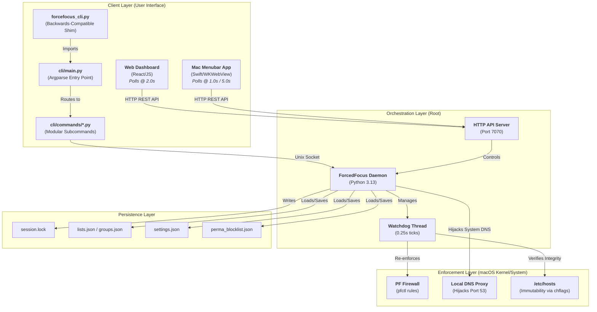

# ForcedFocus Architecture Reference 🗺️

This document describes the multi-layered system design, orchestration, and persistence architecture of ForcedFocus.

---

## 🏗️ Multi-Layer Defense Architecture

The application is structured into four main operational layers: Client (UI/CLI), Orchestration (Daemon/Webserver), Enforcement (macOS Kernel/System), and Persistence.

---

## 🛡️ Enforcement Mechanisms

ForcedFocus operates at the system administration/root level of macOS to ensure blocks cannot be bypassed easily:

1.  **PF Firewall (`pfctl`)**:
    *   Used to block UDP port 443 (QUIC traffic).
    *   This forces web browsers to fallback to standard HTTP/TCP connections, which respects `/etc/hosts` DNS resolution mapping and prevents bypassing hosts-file routing.
2.  **DNS Hijacking / Upstream DNS Proxy**:
    *   In **Whitelist Mode**, the system modifies system DNS settings (`networksetup -setdnsservers`) to point to `127.0.0.1`.
    *   It runs a local DNS proxy server on Port 53 that answers `NXDOMAIN` for blocked requests and proxies allowed ones to upstream DNS.
3.  **Host File Immutability (`chflags`)**:
    *   Appends blocked domains to `/etc/hosts` mapping them to `127.0.0.1`.
    *   Sets the system immutable flag: `chflags uchg /private/etc/hosts`. This blocks any editing, deletion, or renaming of the file (even by the `root` user) until the flag is explicitly unset.

---

## 📂 Persistence Directory (`/etc/forcefocus/`)

The daemon holds state configuration files inside `/etc/forcefocus/`, requiring root permissions for read/write operations:

*   `lists.json`: Stores configured blacklisted and whitelisted domains.
*   `groups.json`: Maps user-defined groups (e.g. `social`, `work`) to domain arrays.
*   `perma_blocklist.json`: Contains the domains to block permanently (session-independent) and countdown parameters for pending unblock requests.
*   `settings.json`: Persists application setting overrides (like sound choices and intent prompts).
*   `session.lock`: Stores current session details (remaining seconds, active mode, start anchors) and pomodoro cycles.
*   `ks_hash`: Stores the PBKDF2-HMAC-SHA256 hash of the unblock security passphrase.
*   `api_token`: Houses the auto-generated authorization token used for validating REST API modifications.
