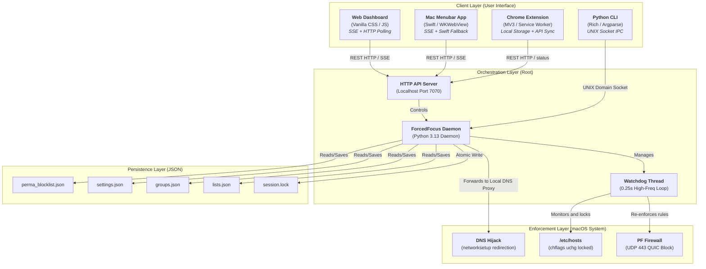

# ForcedFocus UI/UX Implementation Spec

This document serves as the master specification, design blueprint, and acceptance criteria for ForcedFocus, coordinating the front-end style guidelines and the back-end engineering architecture.

---

## Product UX Principles

ForcedFocus should feel like a calm command center for high-integrity focus. The interface must make the current protection state obvious in a few seconds, keep the timer and unlock path prominent, and avoid making the rest of the app feel dead during active focus.

*   **Calm command center**: Use restrained surfaces, stable spacing, and purposeful color. Avoid decorative noise that competes with the timer.
*   **Glanceable status**: Active, idle, scheduled, focus, break, pending unlock, and rescue states must be readable from the left rail without opening another panel.
*   **Active-focus usability**: Users can still manage rules, schedules, templates, and settings while focusing. Only actions that conflict with the running session are disabled.
*   **High-integrity unlock language**: Copy around stopping/unlocking must be explicit, direct, and honest about waiting periods.
*   **Low-friction setup**: Common setup tasks should be reachable with one visible action and should avoid hidden prerequisites.

---

## 1. Overview

ForcedFocus is a multi-layered, root-level productivity enforcement utility for macOS. It is designed to establish an un-bypassable deep work environment using "defense-in-depth" operating system restrictions. 

*   **Core Objective**: Prevent digital distraction at the kernel, firewall, and DNS layers, enforcing session commitment through cryptographic delays and hardware/network lockdowns.
*   **Target Audience**: Developers, sysadmins, writers, and high-performance professionals who require high-integrity focus boundaries and want zero-drift, low-overhead scheduling.

---

## 2. Visual Identity & Design System (UI/UX)

To reflect its role as a secure system utility, ForcedFocus uses a **"Tactical Dark Mode"** aesthetic. The design is clean, high-contrast, structured, and developer-centric, avoiding soft playful shapes or glowing gradient noise.

### 2.1 Color Palette

The following palette defines the primary, secondary, background, and state-color design tokens:

| Token Name | Hex Code | CSS Variable | Applied Context |
| :--- | :--- | :--- | :--- |
| **Obsidian (BG)** | `#09090B` | `--ff-bg-dark` | Global page and window background. |
| **Carbon (Surface)**| `#18181B` | `--ff-surface` | Cards, modal panels, and segmented control backgrounds. |
| **Slate Border** | `#27272A` | `--ff-border` | Default component borders and list splitters. |
| **Accent Indigo** | `#4F46E5` | `--ff-accent` | Primary action buttons, active timers, and focus rings. |
| **Accent Cyan** | `#06B6D4` | `--ff-info` | Telemetry readouts, current mode tags, and helper text. |
| **Focus Emerald** | `#10B981` | `--ff-emerald` | Active session state, pomodoro focus phase indicator. |
| **Delay Amber** | `#F59E0B` | `--ff-amber` | Delayed unlock warning, countdown timer notifications. |
| **Enforced Crimson**| `#EF4444` | `--ff-danger` | Destruction buttons, Rescue mode active state, block notifications. |
| **Crisp Light** | `#FAFAFA` | `--ff-text-main` | Headers, labels, primary navigation links. |
| **Muted Smoke** | `#A1A1AA` | `--ff-text-mute` | Body copy, secondary metadata, inactive control text. |

### 2.2 UI Geometry & Styling

Components follow a rigid, structural geometry to feel robust and secure.

| UI Element | Property | Token Value | Style Specification |
| :--- | :--- | :--- | :--- |
| **Global Cards** | Border Radius | `6px` (`--ff-radius-sm`) | Sharp, structural boxes. No soft pill shapes. |
| **Buttons & Inputs**| Border Radius | `4px` (`--ff-radius-xs`) | Clean, technical input fields and primary actions. |
| **Status Chips** | Border Radius | `4px` | Pill-hybrid but structured, metadata tags. |
| **Borders** | Width & Style | `1px solid` | Explicit, visible borders rather than soft shadow separation. |
| **Elevation/Shadow**| Shadow Style | `Flat Block` | `box-shadow: 4px 4px 0px #000000;` - flat, architectural, non-blurry shadows. |
| **Active Focus Ring**| Outline | `2px Solid` | `outline: 2px solid #4F46E5; outline-offset: 2px;` |

### 2.3 Typography

Typography highlights code-like clarity and maximum legibility for countdown timers and stats:

*   **Headings & Display**: `JetBrains Mono` (or standard system monospaced sans, e.g., `SF Mono`). Sets a professional, developer-focused, technical tone.
*   **Body Copy & Forms**: `Inter` (or system default `-apple-system`, `BlinkMacSystemFont`). High legibility at small sizes, particularly in the compact macOS Menubar popup.
*   **Telemetry & Timers**: `JetBrains Mono` with `font-variant-numeric: tabular-nums`. Prevents text shifting as countdown numbers tick downward.

---

## 3. System Architecture & Tech Stack

ForcedFocus divides operations across client-facing interfaces, local system orchestration, kernel enforcement mechanisms, and filesystem-level persistence.

### 3.1 Tech Stack Summary
*   **Client Layer**:
    *   *Web Dashboard*: Static Vanilla HTML5 / ES6 JavaScript / Vanilla CSS. Served directly from the daemon on port `7070`.
    *   *Menubar App*: macOS native Swift app hosting a sandboxed `WKWebView` pointing to the dashboard, with a Swift-native status polling fallback.
    *   *CLI utility*: Python 3.13 command-line interface utilizing `Rich` for CLI styling.
    *   *Chrome Extension*: Manifest V3 background service worker using `chrome.declarativeNetRequest` for browser-level redirects.
*   **Orchestration Layer**: Python 3.13 daemon running as root, handling IPC commands over a UNIX domain socket and exposing HTTP REST API endpoints.
*   **Enforcement Layer**: MacOS PF Firewall rules (`pfctl`), local system DNS interceptor (`127.0.0.1:53` redirection), and immutable configuration flags (`chflags uchg /etc/hosts`).
*   **Persistence Layer**: Local JSON schemas stored in `/etc/forcefocus/`, utilizing atomic file system swaps for thread-safety.

### 3.2 Architectural Flow Diagram

---

## 4. Database Schema (JSON Schemas)

ForcedFocus stores all persistent state on disk inside `/etc/forcefocus/`. These files function as flat-file collections, ensuring no external database dependencies are required.

### 4.1 Schema: `session.lock` (Active Session State)
Stores the current run configuration and elapsed metrics.

| Field | Type | Description | Key / Relation |
| :--- | :--- | :--- | :--- |
| `active` | Boolean | Declares if a focus block session is currently running. | - |
| `mode` | String | Must be `"blacklist"` or `"whitelist"`. | - |
| `session_type` | String | Must be `"standard"`, `"pomodoro"`, or `"rescue"`. | - |
| `duration_seconds` | Integer | Total configured length of focus session. | - |
| `start_time` | String | ISO 8601 string when session was initiated. | - |
| `end_time` | String | ISO 8601 string when blocking expires. | - |
| `remaining_seconds`| Integer | Monotonically recalculated time remaining. | - |
| `pomodoro_stage` | String | Active phase: `"focus"`, `"short_break"`, `"long_break"`, or `null`. | - |
| `intent` | String | The productivity goal string set at launch. | - |
| `tasks` | Array (JSON) | List of subtasks accompanying the intent. | References nested task items. |

#### Nested Task Item:
*   `id` (Integer): Task identifier.
*   `title` (String): Task description.
*   `done` (Boolean): Completion toggle state.

---

### 4.2 Schema: `lists.json` (Default Blocks & Whitelists)
Contains the core domain lists.

| Field | Type | Description |
| :--- | :--- | :--- |
| `blacklist` | Array (String) | Domains to redirect to loopback when a Blacklist Session starts. |
| `whitelist` | Array (String) | Allowed domains when a Whitelist Session is active. |

---

### 4.3 Schema: `groups.json` (Category Definitions)
Maps categories to groups of domains.

| Field | Type (Key/Val) | Description |
| :--- | :--- | :--- |
| `group_name` (Key) | String | Key defining the group name (e.g., `"social"`, `"gaming"`). |
| `domains` (Value) | Array (String) | List of associated domains mapped to the key. |

---

### 4.4 Schema: `perma_blocklist.json` (Global Restrictions)
Independent list of domains that are locked out regardless of focus status, with delayed unblocking logic.

| Field | Type | Description |
| :--- | :--- | :--- |
| `perma_blacklist` | Array (String) | Domains locked at all times. |
| `pending_unblocks` | Array (JSON) | Tracked unblock requests awaiting their cooldown timer. |

#### Nested Pending Unblock Item:
*   `domain` (String): Target domain requesting removal.
*   `request_time` (String): ISO 8601 when unblock was initiated.
*   `expiry_time` (String): ISO 8601 when unblock countdown ends and the domain is removed.

---

### 4.5 Schema: `settings.json` (Preferences Configuration)
Global daemon preferences.

| Field | Type | Description |
| :--- | :--- | :--- |
| `sound_enabled` | Boolean | If focus cue sounds should play globally. |
| `work_start_sound`| String | Filename of the audio file to play on session start. |
| `break_start_sound`| String| Filename of the audio file to play on Pomodoro break. |
| `sound_volume` | Float | System playback volume (range: `0.0` to `1.0`). |
| `auto_start_next` | Boolean | Auto-advance Pomodoro steps without manual interaction. |

---

## 5. API Design

All endpoints are hosted locally on port `7070`. Writing commands require authorization headers validating the API token.

| Method | Endpoint | Payload (JSON) | Response (JSON) | Description | Auth Req? |
| :--- | :--- | :--- | :--- | :--- | :--- |
| **GET** | `/api/status` | None | `{ "active": bool, "mode": str, ... }` | Retrieves current session lock telemetry. | No |
| **GET** | `/api/stream` | None | *Server-Sent Events (SSE) stream* | Continuous ticks, alerts, and connection updates. | No |
| **GET** | `/api/lists` | None | `{ "blacklist": [str], "whitelist": [str] }` | Returns globally configured blocklists/whitelists. | No |
| **GET** | `/api/groups` | None | `{ "group_name": [str], ... }` | Returns user-defined domain category maps. | No |
| **GET** | `/api/settings` | None | `{ "sound_enabled": bool, ... }` | Returns daemon preferences. | No |
| **GET** | `/api/sounds` | None | `["chime.wav", "alarm.wav", ...]` | Lists available notification sound files. | No |
| **POST** | `/api/start` | `{ "duration_minutes": int, "mode": str, ... }` | `{ "status": "ok", "message": str }` | Spawns a new active focus session. | **Yes** |
| **POST** | `/api/stop` | `{ "key": str }` | `{ "status": "pending", "message": str }` | Verifies passphrase and queues a delayed stop. | **Yes** |
| **POST** | `/api/intent` | `{ "intent": str, "tasks": [...] }` | `{ "status": "ok" }` | Updates active session subtasks/intentions. | **Yes** |
| **POST** | `/api/groups` | `{ "name": str, "domains": [str] }` | `{ "status": "ok" }` | Saves/edits a custom domain group. | **Yes** |
| **DELETE**| `/api/groups` | `{ "name": str }` | `{ "status": "ok" }` | Deletes a custom domain group. | **Yes** |

---

## Acceptance Criteria

- Active focus never applies `.disabled` to `modeCard`, `sessionSettingsCard`, `scheduleCard`, or `rescueCard`.
- During active focus, Rules, Schedules, Templates, and Settings remain usable.
- Rescue is disabled while a session is active and explains why.
- Required DOM IDs used by `web/app.js` and `web/settings.js` remain present.
- `node --check web/app.js` and `node --check web/settings.js` pass.
- `python3 -m pytest` passes.
- Browser smoke checks cover idle, active standard, Pomodoro focus/break, recurring schedule edit, rules edit, and settings save when local browser access is available.
